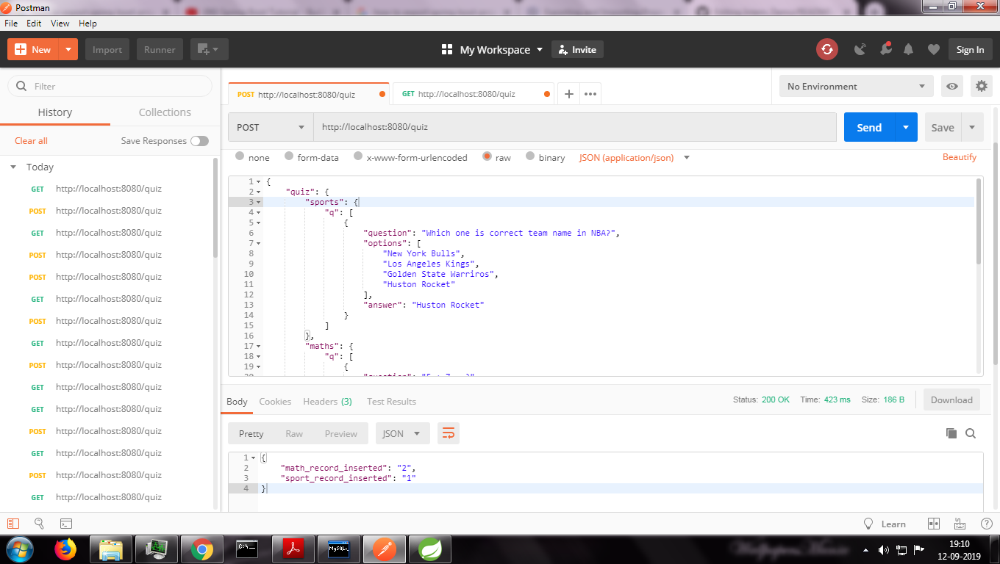
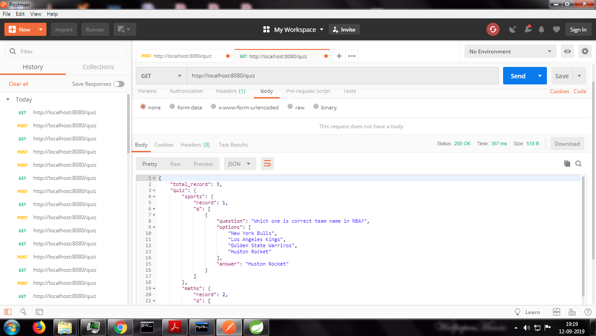

# Project File Descriptions :

I have used Spring Web for this project.

demo_h2.zip : This is the zip file of the project. You can extract this zip file and import in eclipse or STS(spring tool suite).

Inside demo :
  1. Controller : This package deals with controllers for rest services.
  2. data_access_object : This package contains the interfaces that deals with the database.
  3. entitymodels : This package deals with the entity class models that maps the database table.
  4. jsonmodels : This package java class format to accept the json request.
                  In this QuizWrapper contain {
                        Total_Record;
                        Quiz object contain {
                                Math object;
                                Sport object;
                         }
                   }
                   
 ***** Sir after going through the readme if you want I can make project live. *****
 
                                  OR
                                  
 ***** You can download project jar file from below link : 
                        https://drive.google.com/open?id=18ca7WUMPhXeVmzaXz7zEKcPoLNcyq8r4    ******

My project accept json post-request ("localhost:8080/quiz") in this format :
     
     
     {
        "quiz": 
        {
           "sports": 
            {
            
                "q": [
                  {
                      "question": "Which one is correct team name in NBA?",       
                      "options": [
                          "New York Bulls",
                          "Los Angeles Kings",
                          "Golden State Warriros",
                          "Huston Rocket"
                      ],
                      "answer": "Huston Rocket"
                  }
              ]
          },
          "maths": {
              "q": [
                  {
                      "question": "5 + 7 = ?",
                      "options": [
                          "10",
                          "11",
                          "12",
                          "13"
                      ],
                      "answer": "12"
                  }
              ]
          }
      }
  }
  

After this response will be :

    {
      "math_record_inserted": "2",
      "sport_record_inserted": "1"
    }

In my project I have used Postman for this

If I want to see record we have to do get-request ("localhost:8080/quiz") and my response will be :

 

    {
    "total_record": 3,   
    "quiz": {
       "sports": {
            "record": 1
            "q": [            
                {
                    "question": "Which one is correct team name in NBA?",
                    "options": [
                        "New York Bulls",
                        "Los Angeles Kings",
                        "Golden State Warriros",
                        "Huston Rocket"
                    ],
                    "answer": "Huston Rocket"
                }
            ]
        },
        "maths": {
            "record": 2,
            "q": [
                {
                    "question": "5 + 7 = ?",
                    "options": [
                        "10",
                        "11",
                        "12",
                        "13"
                    ],
                    "answer": "12"
                },
                {
                    "question": "12 - 8 = ?",
                    "options": [
                        "1",
                        "2",
                        "3",
                        "4"
                    ],
                    "answer": "4"
                }
            ]
          }
      }
    }

These are the records :

